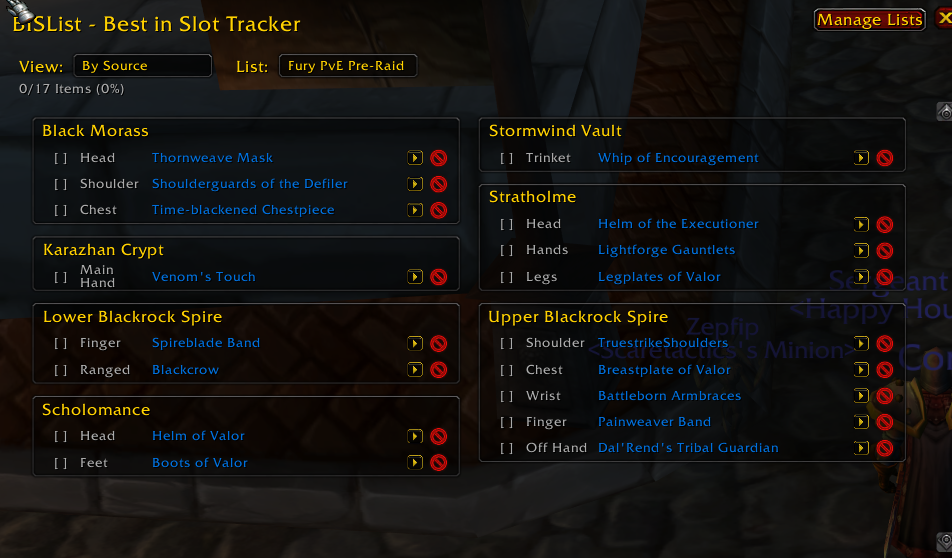

# BISList - Best-in-Slot Item Tracker

Track your Best-in-Slot gear efficiently across multiple equipment lists for World of Warcraft 1.12.1 (Vanilla).

## Features

### Multiple Lists
- Create unlimited equipment lists per character
- Default lists: Leveling, PvE, PvP
- Easily rename, create, or delete lists
- Each list tracks items independently

### Quick Item Management
- **ALT+B** keybind to instantly add items from AtlasLoot
- Add items from chat links, bags, or any source
- Visual checkmarks for acquired items
- Move items between lists
- Remove unwanted items with one click

### Two View Modes
- **By Slot**: Organized by equipment slot (Head, Shoulder, Chest, etc.)
- **By Source**: Grouped by dungeon/raid (automatically detected)
  - Sorted by most items first
  - Row-by-row layout for easy priority viewing

### Smart Source Detection
- Automatically detects dungeon/raid sources for 3,400+ items
- Items added from AtlasLoot include source information
- Items from other sources are looked up in the embedded database
- No AtlasLoot dependency required

### Progress Tracking
- Visual acquisition status with checkmarks
- Item counter showing completion percentage
- Track progress per list

### pfUI Compatible
- Minimap button integrates with pfUI
- Clean, consistent UI styling

## Usage

### Opening BISList
- Click the minimap button
- Type `/bis` or `/bislist` in chat

### Adding Items
1. **From AtlasLoot**: Hover over an item and press **ALT+B**
2. **From Chat/Bags**: ALT+Click any item link
3. One-hand weapons will prompt you to choose Main Hand or Off Hand

### Managing Lists
1. Click "Manage Lists" button
2. Create new lists, rename, or delete existing ones
3. Move items between lists using the arrow button next to each item

### Marking Items as Acquired
- Click the checkbox next to any item to mark it as obtained
- Acquired items show a green checkmark

### Viewing Your Gear
- **By Slot**: See all items organized by equipment slot
- **By Source**: See items grouped by dungeon/raid, sorted by priority

## Installation

1. Extract the BISList folder to `World of Warcraft/Interface/AddOns/`
2. Restart World of Warcraft
3. Character-specific lists are automatically saved

## Commands

- `/bis` - Toggle BISList window
- `/bislist` - Toggle BISList window

## Requirements

- World of Warcraft 1.12.1 (Vanilla)
- No dependencies required (works standalone)

## Notes

- All data is saved per-character
- Lists persist across game sessions
- AtlasLoot integration is optional but recommended for best experience
